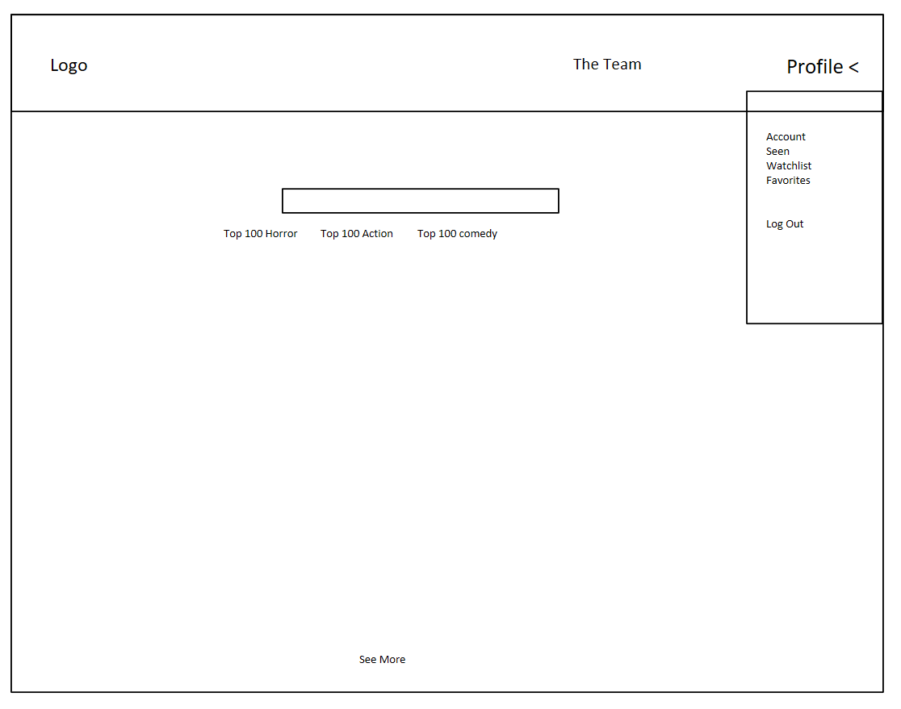
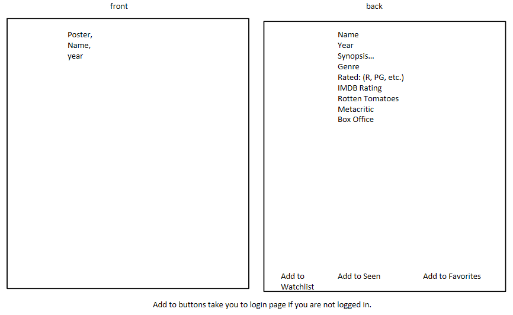
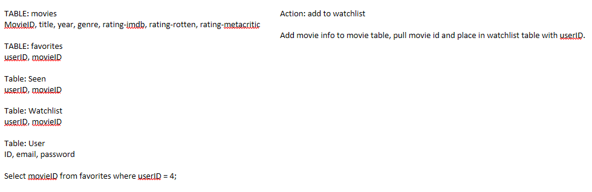

## The Movie Matrix 


## AWS <>


This is app allows the user to search for different movies and return a list of movies based of their input. There is also a list of prepopulated Top 100 movies based off genre that the user can scroll through. Each movie card will contain data on the front and then once clicked, data on the back. Once the user has registered an account and they are logged in they can then search or used the prepopulated lists to save the movie to a "Want to Watch List", "Seen List" or "Favorites List".


**How To Use App**

- Account Login Name: test123@google.com
- Password for Account: 1234

To use the app simply click on the link provided above. User can choose to register and login or can use the login and password that are provided directly above. Once logged in the user can search for certain movies or use the pre-populated lists. To see the details of the movie card just simply click anywhere on the card of the movie and a modal dialog box will appear with the specific information regarding that movie. If the user decides they want to add this to any of their lists, they can hit either "Add to Watch List", "Add to Seen List", or "Add to Favorites". Once the user has added to the appropriate group the user can then navigate to the corresponding page which is located within the "Profile" dropdown menu. Here they can see each individual page that will correspond to any movies that have been saved. When the user is finished, they can simply logout. 

**Tech Stack**

- Javascript, HTML, Tailwind CSS, SQL, Sequelize, Passport
- API : TMDb API, OMDb API

**MVP**

Our base goal was to give the user the ability the register a username and password, login and choose a movie from the pre-populated lists so that they can add a chosen movie to a seen, favorites or watched list. 







**Stretch Goals**

Implement a search bar that allows user to search the API directly and bring back results.

**Code Snippets**

```
Joe Code
```


```
Jacob Code
```


```
Ian Code
```


**Screen Shots or GIFS**


**Developer Team**

- Joe Stocks: UX, Shopping List
- Jacob Deel: UX, Mapbox API
- Ian Haddock: Login, Registration, and Saving Cards to list. 